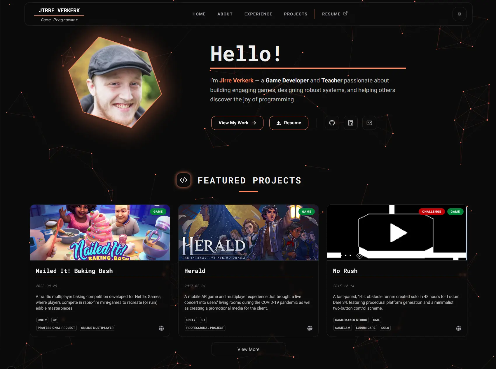

<div align="center">



<a name="readme-top"></a>

# Portfolio

A personal portfolio website built with Next.js, featuring project showcases, responsive design, and MDX-based content management.

<p>
    
</p>


<p align="center">
  <a href="#technologies">Technologies</a> •
  <a href="#getting-started">Getting Started</a> •
  <a href="#docker-setup">Docker Setup</a> •
  <a href="#available-scripts">Available Scripts</a> •
  <a href="#project-structure">Project Structure</a>
</p>

</div>

## Technologies

- **Framework:** [Next.js 16](https://nextjs.org/) (App Router)
- **Styling:** [Tailwind CSS](https://tailwindcss.com/)
- **Content:** [MDX](https://mdxjs.com/) with `next-mdx-remote` and `gray-matter`
- **Animations:** [Motion](https://motion.dev/)
- **Icons:** [React Icons](https://react-icons.github.io/react-icons/)
- **Language:** [TypeScript](https://www.typescriptlang.org/)

## Getting Started

### Prerequisites

- Node.js 22.x
- npm

### Installation

1. Clone the repository:
   ```bash
   git clone <repository-url>
   cd Portfolio
   ```

2. Install dependencies:
   ```bash
   npm install
   ```

3. Run the development server:
   ```bash
   npm run dev
   ```

4. Open [http://localhost:3000](http://localhost:3000) with your browser to see the result.

## Docker Setup

You can also run the project using Docker.

### Build the image

```bash
docker build -t portfolio-web .
```

### Run the container

```bash
docker run -p 3000:3000 portfolio-web
```

The application will be available at [http://localhost:3000](http://localhost:3000).

## Available Scripts

- `npm run dev` – Starts the development server.
- `npm run build` – Creates an optimized production build.
- `npm run start` – Starts the production server.
- `npm run lint` – Runs ESLint to check for code quality issues.

## Project Structure

- `src/app/` – Next.js App Router pages and layouts.
- `src/components/` – Reusable UI components.
- `src/features/` – Feature-specific logic, components, and content (e.g., projects).
- `src/utils/` – Utility functions.
- `public/` – Static assets.
